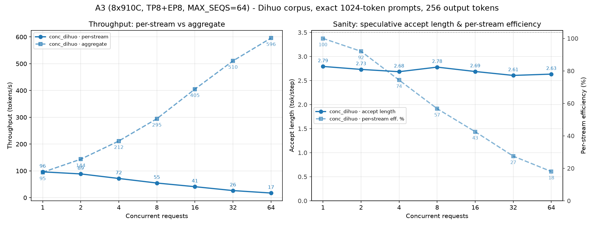

# DeepSeek-V4.1-Flash W4A8 优化版推理服务

在 **Ascend 910B（A2，8×910B3）** 与 **Ascend 910C（A3，8×910C）** 上拉起
DeepSeek-V4.1-Flash 的 W4A8 量化推理服务，含完整补丁、一键起服、自检与验收。

**本包的全部优化工作（算子分析、补丁编写、性能调优、文档）均由 `deepseek-v4.1-flash`
模型自主完成**，未经人工逐行改写。

---

## 1. 这个包解决什么问题

官方镜像里的 vllm-ascend 能跑起 DeepSeek-V4.1-Flash，但在长上下文与高并发下有几处
明确的性能瓶颈。本包提供 11 个补丁（8 个性能 + 1 个调度 + 2 个量化适配）与配套脚本，
把这些瓶颈逐个消掉，并给出**可复现的验收口径**。

约束（交付形态必须成立）：

* Engram-int8 常驻 DRAM
* DSpark 投机解码开启（5 tokens）
* KV cache 在 HBM 且 **> 3M tokens**（实测详见 §2.5 的取舍说明）
* Vision 23/23、GSM8K ≈198/200
* 静态内核不得静默降级（`static_kernel.py:650` 命中数必须为 0）

## 2. 一键起服

### 2.1 A3（8×910C）

```bash
# ① 先看哪些卡空着（只读，打印每张卡的占用与进程属主）
bash tools/list_chips.sh

# ② 指定要用的 8 张卡（DEVS 必填，脚本不替你选）
DEVS="8 9 10 11 12 13 14 15" \
  MODEL=/path/to/v41-w4a8-engram-dr-vision-qrot-mtpq \
  bash scripts/serve_a3.sh
```

`DEVS` 是**用户输入**：一台机器上哪 8 张能用取决于当前谁在跑什么，脚本无法替你判断。
默认会**拒绝已被占用的卡**并打印占用进程（确实要带占用起服务才加 `ALLOW_BUSY=1`）。

### 2.2 A2（8×910B3）

```bash
# 发包前（10 秒，不起容器）：确认 Dockerfile 落位表 / patches/files / MD5SUMS 三方一致
bash tools/check_checksums.sh

bash scripts/build_image.sh                 # 烘焙补丁，产出 dsv41-a2:v8（约 10–20 min）
MODEL=/path/to/v41-w4a8-engram-dr-vision-qrot-mtpq bash scripts/serve_a2.sh
```

**⚠️ 用发布包里的 `scripts/serve_a2.sh`，不要用镜像里那份。** `build_image.sh` 会把脚本
COPY 进镜像的 `/opt/dsv41/scripts/`，那是**构建时**的快照，可能比包旧（跑它就等于跳过
本包的修复）。脚本每次起服都打印自己的路径 + 版本 + md5：

```
[serve_a2] script=/path/to/包/scripts/serve_a2.sh ver=v8-engram-rw-mount-20260920 md5=…
```

报障时先看这一行；若它指向 `/opt/dsv41/scripts/serve_a2.sh`，改成包里那份再跑。

**★ `engram_int8/` 必须可写挂载**（v8 起；A2 真机踩过，见 `CHANGELOG.md` v8 §14）：
Engram 表要由设备算子直接索引，走的是 `os.open(path, O_RDWR)` +
`PROT_WRITE|MAP_SHARED` 的 `mmap`，再交给
`aclrtHostRegister(..., ACL_HOST_REGISTER_MAPPED)`。**只读 VMA 会被驱动拒绝**
（`ret=507899`），而 `os.open` 在 read-only 挂载上先就报 `EROFS`。代码本身只**读**
这些文件——要写权限纯粹是驱动注册的要求，不是我们想改它们。

起服脚本**自己会把这件事办掉**：三条挂载路径（`auto` / `ancestor` / 单层 fallback）
都会把 engram 表目录**单独叠加**成 `:rw`，其余模型目录保持 `:ro`；并且在
`docker run` **之前**自检（目录存在 + 最深覆盖它的那条挂载必须是 `:rw`），不满足就
直接失败并给出修法，而不是等你在容器里看到 `aclrtHostRegister failed: ret=507899`。

| 情况 | 你该做什么 |
|---|---|
| 默认（`MODEL_MOUNT_MODE=auto`） | **什么都不用做**，脚本自动叠加 `:rw` |
| 想先确认 | `DRY_RUN=1 MODEL=<模型目录> bash scripts/serve_a2.sh`（不碰 docker），看 engram 那几行是不是 `:rw` |
| 报"宿主上不可写"的 WARNING | 一般**忽略即可**：容器以 root 运行，挂载是 `:rw` 就能 `O_RDWR`（A3 真机的表就是 `root:root 0600`）。只有用**非 root** 起容器时才需要 `chmod u+w` / 换属主 |
| 起服前自检 FAIL（engram 目录被 `:ro` 覆盖 / 目录不存在） | 按报错里的修法：改回 `MODEL_MOUNT_MODE=auto`（默认）；若是模型目录里没有 `engram_int8/`，那是模型不完整，先补上 |
| 就是想绕开 | `ENGRAM_DEVICE_INDEX=0` —— **干净的退路**：走 host 路径，完全不要求可写，代价是关掉 v8 的 device-index 加速 |

#### ⚠️ Engram 算子入图的**默认口径**：A3 开、A2 关（2026-09-20 定稿）

`ENGRAM_DEVICE_INDEX=auto`（默认）**不是**看机型名，而是看驱动侧的
**`host_mem_pool` 特性**（`/proc/svm/dev<N>/feature/host_mem_pool`，普通用户可读）：

| 机型 | CPU↔NPU 协议 | `host_mem_pool` | 默认行为 |
|---|---|---|---|
| **A3 (910C)** | HCCS | **1** | **开启** Engram 算子入图（8 rank × 206 GiB 起服约 **133 秒**） |
| **A2 (910B3)** | PCIe | **0** | **关闭**，自动回退 host 路径（**功能与精度不变**，只是没有该项加速） |

**A2 为什么必须关**：`host_mem_pool=0` 时 `aclrtHostRegister` 走逐页建元数据的
慢路径（每 4 KiB 页 64 B），整表 206 GiB × 2 层 × 8 rank 会让单次 `vmalloc`
申请约 2.06 GiB 连续内核内存 —— A2 上实测 **17 分钟后** `ret=207001`
（`ACL_ERROR_RT_MEMORY_ALLOCATION`），而**同一时刻宿主机 `MemAvailable` 仍有
703 GiB**（不是物理内存不足）。完整机制与三条被否证的绕行方案见
[`CHANGELOG.md`](CHANGELOG.md) v8 §3。

判断只需一条命令（不入容器）：
```bash
cat /proc/svm/dev0/feature/host_mem_pool     # 1 = A3 口径，0 = A2 口径
```

起服日志会明确打印走到了哪一边：
```
[DEVICE-INDEX] 能力探测通过，Engram 算子入图已启用：/proc/svm/dev0/feature/host_mem_pool=1（…）
```
或
```
[DEVICE-INDEX] 本机不满足 Engram 算子入图的条件，自动回退到 host 路径（功能与精度不变）…
```

`build_image.sh` 最后一步的逐文件 md5 校验**不再手写**：期望值在构建时由
`patches/files/**` 的字节现算（落位表取自 `Dockerfile`），因此"改了补丁忘了改校验和"
不会再让用户白等 10–20 分钟 —— 详见 [`CHANGELOG.md`](CHANGELOG.md) v8 §11。

### 2.3 起服前/后

```bash
# 起服前（30 秒，不起容器）：9 组自检
MODEL=/path/to/model bash tools/preflight_a2.sh

# 干跑：只打印将执行的命令，不碰 docker
DRY_RUN=1 ... bash scripts/serve_a3.sh

# 服务已在跑时：附着自检（不起容器、不删容器）
PORT=8020 bash tools/attach_test.sh

# 完整验收：8K/32K/128K + Vision + GSM8K
MODEL=/path/to/model MODE=full bash scripts/run_test.sh
```

### 2.4 两个默认值

| 开关 | 默认 | 说明 |
|---|---|---|
| `PREFIX` | **1（开）** | prefix caching。面向用户的默认是生产形态。要测**无前缀缓存**的性能口径用 `NO_PREFIX=1`（等价 `PREFIX=0`）。两种口径的 ms/step 与接受长度**不可直接混比**，报数字时必须写明。 |
| `MAX_SEQS` | **32** | 并发上限。它会决定 CUDA graph 的捕获桶数，越大启动时捕获越久（首次多 1–2 min）。 |
| `BAT_TOKENS` | **8192** | `--max-num-batched-tokens`。**正确性关键参数**，见 §2.5 —— 不要随手调小。 |

### 2.5 ★ `BAT_TOKENS`：长上下文正确率的开关

chunked prefill 把长 prompt 切成 `ceil(prompt / BAT_TOKENS)` 段依次前向。
**每段都有一次独立的"偏离"机会，且误差沿后续 chunk 累积** ——
实测偏离率约 **2%/chunk**，因此 **chunk 数越多、长上下文正确率越低**，
而且是**平滑下滑**（不是"超过某个长度就崩"）。

用"把唯一事实埋在长文档中段、只问一个答案唯一的问题"做探针，
每档 10 个不同样本（内容不同）：

| prompt_tokens | `BAT=2048`（10 chunk/20K tok） | `BAT=8192` |
|---:|---:|---:|
| 10,394 | 10/10 | **10/10** |
| 20,318 | 8/10 | **10/10** |
| 40,163 | 7/10 | **10/10** |
| 60,012 | 5/10 | **10/10** |
| 79,855 | 3/10 | **10/10** |
| 149,986 | ~0% | **6/6** |
| 259,985 | ~0% | **6/6** |

⇒ **默认 `BAT_TOKENS=8192` 把这七档全部拉到 100%**，同一 prompt 重复 10 次
输出逐字节一致。

**代价**：activation 峰值从 0.79 涨到 **3.21 GiB**，KV cache 从
**4,145,957 → 2,823,080 tokens**（8×910C、默认 `GPU_UTIL=0.92` 实测；
若用 0.94 则是 3,088,412，但那样 prefill 会慢 6~7×，见下）。
若你的场景更看重 KV 容量、且上下文主要在 <20K，可以显式 `BAT_TOKENS=2048`。

> ⚠️ **`GPU_UTIL` 是本包最重要的性能开关** —— 0.94 会让长 prompt 的 prefill 慢 6~7×：
>
> | `GPU_UTIL` | 设备余量 | 8K prompt 首 token | KV tokens |
> |---:|---:|---:|---:|
> | **0.92（默认）** | **7.36 GiB** | **1.14 s** | **2,823,080** |
> | 0.94 | 6.11 GiB | **8.0 s** | 3,088,412 |
> | 0.88 | 9.80 GiB | 1.28 s | 更少 |
>
> 原因是**真实请求的 activation 峰值远高于启动 profiling 报告的值**：
> profiling 在 KV cache 分配**之前**量到 3.21 GiB，而真实 8K prefill 需要
> **约 6 GiB**（差额 2.8 GiB）。余量不足时分配器要反复向驱动申请/归还，
> `forward` 慢 2.1×，新请求还要多等 ~6 s 把池子撑大。
> **详细机制与全部证据见 [`docs/prefill-memory-headroom.md`](docs/prefill-memory-headroom.md)。**
>
> ⚠️ 也**不要往 0.95 及以上调**：实测首个真实 prefill 就 OOM；
> `BAT=6144` + `GPU_UTIL=0.94` 会 ACL graph 重放 OOM。
> 若必须满足更高的 KV 门槛，应评估裁剪 `CAPTURE_SIZES`
> （代价：高并发 decode 退回 eager），而不是调 `GPU_UTIL`。

> **自查方法**：本包提供 `tests/agent_trace/longctx_retrieval.py`，
> 用 `--tokens 60000 --reps 10` 跑一次，正常应 10/10。
>
> 详细分析（含机制、消融、方法论教训）：[`reports/longctx-accuracy-fix.md`](reports/longctx-accuracy-fix.md)

### 2.6 绑核

**外部不计算绑核位置**：容器默认不设 `--cpuset-cpus/--cpuset-mems`，
由 vllm-ascend 内部的 `cpu_binding` 按 NPU 拓扑给每个 rank 自己绑
（`--additional-config` 的 `"enable_cpu_binding": true`）。起服日志里能看到它的决策：

```
[cpu_binding.py] [cpu_bind_mode] mode=topo_affinity rank=0 visible_npus=[...]
[cpu_binding.py] NPU8: main=[322..357] acl=[358] release=[[359]]
[cpu_binding.py] [migrate] NPU:15 -> NUMA [7]
```

> 为什么不在外部绑：外部先圈定 NUMA 等于替内部做了决定，一旦选卡组合与外部区间对不上
> （多机、多租户、混合选卡），内部再绑也回不到正确节点。位置交给知道拓扑的那一方。

`CPUSET=`/`MEMS=` 保留为逃生口，显式给了才会透传给 docker。

#### ⚠️ 已知故障：`[migrate]` 可能永久卡死起服（2026-09-20 实测，A3）

内部绑核的最后一步是 `migratepages <pid> <all-nodes> <target-node>`，
把 worker 进程的**全部常驻页**迁到它那张卡所在的 NUMA 节点。在本模型上这个进程的
RSS 很大（Engram 表常驻 DRAM，实测单 rank **132 GB**、虚拟地址空间 **9.9 TB**），
于是这步可能从"几十秒"变成**永远不结束**。实测症状：

```
$ ps -eo etimes,pcpu,stat,args | grep migratepages
  1201  97.8 R  migratepages 1402 0,1,2,3,4,5,6,7 6      ← 20 分钟、97% CPU、零进展
$ grep -o 'N6=[0-9]*' /proc/1402/numa_maps | ...
N6_pages=532650   ← 90 秒后仍是 532650（一个页都没动）
```

同时 `/dev/shm` 会出现 `No available shared memory broadcast block found in 60 seconds`
（那是引擎在等 worker，不是共享内存泄漏）。**服务不会自己恢复。**

**处置**：停掉容器，用 `CPU_BIND=0` 重启（跳过内部绑核与页面迁移）：

```bash
DEVS="8 9 10 11 12 13 14 15" CPU_BIND=0 MODEL=... bash scripts/serve_a3.sh
```

> 这一步只影响**起服路径**，不影响我们验证过的其它优化；设备侧的 NPU 中断绑定、
> acl/release 线程绑定都在这步之后或独立进行。绑核带来的性能差异请自己做 A/B。
> **A3 上我们最终的推荐做法是先用 `CPU_BIND=0` 把服务起起来**；要试内部绑核，
> 请守着 `migratepages` 的 `ps` 输出，确认它真的在动。

### 2.7 ★ `DRAFT_GRAPH=1`：投机解码入图（**低并发推荐开启**，默认关）

**怎么开**：
```bash
DRAFT_GRAPH=1 bash scripts/serve_a2.sh       # A2
DRAFT_GRAPH=1 DEVS="8 9 ..." bash scripts/serve_a3.sh   # A3
```

**收益 —— A2 比 A3 大得多**（A3 是同进程 A/B；A2 是跨会话对比，见
[`reports/a2-draft-graph-20260920.md`](reports/a2-draft-graph-20260920.md)）：

| 机器 | 指标 | eager（默认 `DRAFT_GRAPH=0`） | **入图（`=1`）** | 变化 |
|---|---|---:|---:|---|
| **A3** 8×910C | decode per-step | 36.9 ms | **23.9 – 24.9 ms** | −12 ~ −13 ms（**−35%**） |
| **A3** | 单流吞吐 | 66.5 tok/s | **100.7 – 109.8 tok/s** | **+51% ~ +65%** |
| **A3** | 接受长度 A | 2.455 | 2.403 – 2.738 | **持平** |
| **A2** 8×910B3 | decode per-step | 64.8 ms | **34.3 ms** | **−30.5 ms（−47%）** |
| **A2** | 单流吞吐 | 54.7 tok/s | **88.7 tok/s** | **+62%** |
| **A2** | 接受长度 A | 3.44 | 3.03 | 同一量级 |

> A3 数据源是同进程配对臂（`results/e2e_fix_H_final/guard_{E1,G1,G2}.json`，
> 1024 prompt / 256 out、`conc=1` 档 8 发中位）；A2 数据源见
> [`reports/a2-draft-graph-20260920.md`](reports/a2-draft-graph-20260920.md)（**跨会话**，
> 设备侧 `[bneck] hp` + APIServer 稳态，两者互相自洽）。

⇒ **A2 的绝对收益是 A3 的 2.3 倍**（−30.5 vs −13 ms/step）：910B3 的 CPU 更弱
⇒ draft 的 eager 派发开销更大 ⇒ 挪进图里省得更多。**`DRAFT_GRAPH=1` 是 A2 上唯一的大杠杆**
（A2 的 Engram 算子入图因 `host_register ret=207001` 不可用，见 §2.2 的默认口径说明）；
打开后 A2 单流 **88.7 tok/s 已追平 A3 的水平**。

**⚠️ 但收益与并发强相关 —— 高并发下反而变慢**（A3 同口径 1–64 档实测）：

| 场景 | 并发 | 结论 |
|---|---|---|
| **交互式 / 单流** | **1 – 2** | **开**：单流 **+12 ~ +22%**，总吞吐 +8 ~ +24% |
| 中等并发 | 4 – 8 | 关：总吞吐 **−5.0%**（单流 −4 ~ −8%） |
| **离线批量** | **≥ 16** | **关**：总吞吐 −6 ~ −10% |

完整逐档对照见 §3.2 的 **C 表**（接受长度全程持平 ⇒ 不是质量退化）。
⚠️ 这个开关**只能在起服时决定**（`DRAFT_GRAPH=1 bash scripts/serve_*.sh`），
所以要先确定这台机器的主用途。**A2 的目标场景是单流交互 ⇒ 开。**

**精度已验收**（A3）：Vision **23/23**、GSM8K-200 **198/200 = 99.0%**（历史 195/200）、
10 条质量判据 10/10。（A2 本次：Vision **23/23**。）

**为什么默认仍是 0**：存在一个**极罕见**的坏状态 —— 进程活着、`/health` 返回 200、
但 draft 全部不被接受（`A` 永久 1.00）且**输出变空**。截至目前是
**1 次观测、6 轮独立复现尝试（≈36 个测量点、10.4 分钟连续负载）全部未复现**，
5 条机制猜测（探针伪影 / 前置新桶 / RT 热切换 / 两类 padding 写脏 KV）**全部被否证**。
由于它的失效形态**静默且永久**，我们不把它设为默认；但收益足够大，值得显式开启。

**坏状态的判据与恢复**（记住这一条就够）：
> 连续两次 specdec metrics 出现 `Mean acceptance length: 1.00` **且**
> `Accepted throughput: 0.00` ⇒ 判定已进入坏状态 ⇒ **重启服务即可恢复**。
> 那时不必再发请求试探（引擎已坏）。

**`serve_a2.sh` 会替你守住一个静默陷阱**：`DRAFT_GRAPH=1` 必须配
`DSPARK_GRAPH_CAPTURE_METADATA=1`，否则 draft 图会**静默失效**（A 恒 1.0 但 ms/step
看着还正常 —— 见 `reports/draft-graph-negative-control.md`）。脚本把这两个开关绑在一起设，
并在起服后做一次 DRAFT-GUARD 校验，组合不对会直接 `die`。

**四件套开关无需手工设置**（`DRAFT_GRAPH=1` 时自动全开，缺一不可）：
`DSPARK_CAPTURE_VALUE_FIX=1`、`DSPARK_SWA_INDICES_RESIDENT=1`、
`DSPARK_CAPTURE_NCTX_FIX=1`、`DSPARK_DISPATCH_QUERY_LEN_FIX=1`。
排查细节与全部否证记录见 [`reports/draft-graph-investigation-20260920.md`](reports/draft-graph-investigation-20260920.md)。

### 2.8 ★ 让 codex 直接连本服务（Responses API 兼容补丁）

本包的 `tokenizer_mode=deepseek_v41` 走 vllm-ascend 的 DSV4.1 前端编码器，它只认
**chat-completions** 的块词汇表（`text`/`tool_result`/`image_url`），而 **codex 等 OpenAI
客户端**发的是 **Responses** 词汇表（`input_text`/`output_text`/`input_image`）。
这个落差会让 codex **直连不可用**，而且**其中两条是静默的**：

| 缺陷 | 症状 |
|---|---|
| `input_text` 块被渲染成**字面量** `[Unsupported input_text]` | **HTTP 200**，但**用户的话根本没进模型** |
| codex 放系统指令的 `developer` 角色要求 content 非空 | **HTTP 500** |
| `<｜User｜>`/`<｜Assistant｜>` 等控制 token 可从正文注入 | 实测可**伪造轮次边界** |

**一键使能**（装进正在跑的容器，幂等、带备份与回滚）：

```bash
docker exec dsv41-a3 bash /opt/dsv41/tools/enable_codex_responses.sh on
docker exec dsv41-a3 bash /opt/dsv41/tools/enable_codex_responses.sh status   # PATCHED / STOCK
docker exec dsv41-a3 bash /opt/dsv41/tools/enable_codex_responses.sh off      # 还原
```

⚠️ **改的是容器可写层，需要重启服务才生效**；容器重建/换镜像会丢，重跑脚本即可。
**重启前务必确认没有残留进程**（`VLLM::EngineCore` / `VLLM::Worker_*` 的进程名里**没有**
`vllm serve`，`pkill -f "vllm serve"` 杀不到），否则起服会卡在 `rtsMallocHost 207001`：

```bash
docker exec <容器> bash -c 'ps -eo pid,args | grep -E "[V]LLM::|[v]llm serve"'   # 应输出空
docker stop -t 10 <容器> && docker start <容器>
```

codex 侧配置（`~/.codex/config.toml`）：

```toml
model = "deepseek-v41"
model_provider = "local-a3"
approval_policy = "never"
sandbox_mode = "danger-full-access"
[model_providers.local-a3]
name = "local-a3-vllm"
base_url = "http://127.0.0.1:8020/v1"
wire_api = "responses"
```

**A3 真机实测通过**：单轮文本、**工具调用**（shell）、**图片**（`view_image`）、
**多轮会话**（`resume`）、**子代理**（`multi_agent_v1`）。
补丁细节、验证方法、以及 4 条已知边界见
[`patches/files/patch_deepseek_v41_frontend/README-integration.md`](patches/files/patch_deepseek_v41_frontend/README-integration.md)。

> `input_image` 块**必须带 `detail` 字段**（`{"type":"input_image","image_url":"…","detail":"auto"}`），
> 缺了会被 Responses 协议拒掉（400）。

## 3. 性能数据

### 3.1 单流延迟（128K 上下文）

**A3（8×910C）实测**，128K 上下文、单流独占：

| 指标 | 值 |
|---|---|
| ms/step | 中位 **30.2 – 31.6**，最好 26.9 |
| 单流 tok/s | 中位 **85 – 90** |
| KV 池 | **3,088,412 tokens**（`BAT_TOKENS=8192`，见 §2.5） |

> ⚠️ 上表是**发布默认配置**（`DRAFT_GRAPH=0`）。**开 `DRAFT_GRAPH=1` 后单流明显更快**
> （1024 prompt / 256 out、`conc=1` 档 8 发中位）：
>
> | | ms/step | 单流 tok/s |
> |---|---:|---:|
> | A3 eager → 入图 | 36.9 → **23.9 / 24.9** | 66.5 → **100.7 / 109.8** |
> | A2 eager → 入图 | 64.8 → **34.3** | 54.7 → **88.7** |
>
> A2 的口径与完整数据见 [`reports/a2-draft-graph-20260920.md`](reports/a2-draft-graph-20260920.md)。

> 语料为《红楼梦》全本按目标 token 数精确截取 + 指令后缀（quote 口径）。
> 口径：**unprofiled 客户端墙钟**，单流独占。
>
> ⚠️ 不要用接受长度当绩效指标 —— 它与文本质量**反相关**（脏会话里反而更高）。
> 报数字请用 `(clean-rate, ms/step)` 或上面这种 `(ms/step, tok/s)` 组合。

### 3.2 并发吞吐



**A3（8×910C，TP8+EP8）实测**，`MAX_SEQS=64` + `PREFIX=1`（生产口径），
prompt **每条精确 1024 token** / 输出 256 token（`ignore_eos` 强制生成满），
**每档都跑完同一批 64 条请求**，2 次取中位数。下面 A / B 两组**方法完全一致**，
只差一个 `DRAFT_GRAPH`：

> **`decode step`（ms）＝ `1000 × 接受长度 ÷ 单流吞吐`** —— 服务**走一步**的总时间。
> 并发越高、一步里塞进的流越多 ⇒ 它必然变大；但它变大的同时，**一步产出的 token 也更多**
> （一步产出 ≈ 并发数 × 接受长度）。所以**不能**用 `decode step` 单独判断好坏。

#### A. `DRAFT_GRAPH=0`（eager draft —— 历史默认）

| 并发 | 单流吞吐 (tok/s) | **decode step (ms)** | 总吞吐 (tok/s) | 加速比 | 单流效率 | 接受长度 | TTFT |
|---:|---:|---:|---:|---:|---:|---:|---:|
| 1 | **90.3** | **31.1** | 87.1 | 1.00× | 100.0% | 2.81 | 0.20 s |
| 2 | **89.2** | **31.7** | 151.5 | 1.74× | 98.8% | 2.82 | 0.36 s |
| 4 | **80.0** | **35.0** | 237.7 | 2.73× | 88.7% | 2.80 | 0.55 s |
| 8 | **59.3** | **48.6** | 324.4 | 3.72× | 65.6% | 2.88 | 0.94 s |
| 16 | **42.5** | **65.4** | 432.6 | 4.97× | 47.1% | 2.78 | 1.83 s |
| 32 | **31.3** | **91.3** | 583.9 | 6.70× | 34.7% | 2.86 | 3.82 s |
| 64 | **20.2** | **139.9** | **719.5** | 8.26× | 22.3% | 2.82 | 7.16 s |

#### B. `DRAFT_GRAPH=1`（draft 入图 —— §2.7 推荐开启）

| 并发 | 单流吞吐 (tok/s) | **decode step (ms)** | 总吞吐 (tok/s) | 加速比 | 单流效率 | 接受长度 | TTFT |
|---:|---:|---:|---:|---:|---:|---:|---:|
| 1 | **110.3** | **25.1** | 108.3 | 1.00× | 100.0% | 2.77 | 0.22 s |
| 2 | 100.4 | **28.6** | 164.1 | 1.52× | 91.0% | 2.87 | 0.43 s |
| 4 | 76.8 | **36.1** | 225.8 | 2.08× | 69.6% | 2.77 | 0.67 s |
| 8 | 54.7 | **51.0** | 308.2 | 2.85× | 49.6% | 2.79 | 1.14 s |
| 16 | 40.9 | **67.4** | 407.5 | 3.76× | 37.1% | 2.76 | 2.14 s |
| 32 | 29.6 | **94.4** | 542.1 | 5.01× | 26.8% | 2.80 | 4.35 s |
| 64 | **19.2** | **145.9** | **646.2** | 5.97× | 17.4% | 2.80 | 8.60 s |

> B 表的**加速比 / 单流效率以本组 `conc=1`（108.3 tok/s）为基线**，不是 A 组的 87.1 ——
> 两组基线不同，**跨表比"加速比"没有意义**；要比就比同并发下的绝对值（见下）。

#### C. ★ 同并发直接对比：`DRAFT_GRAPH=1` 相对 `=0` 的变化

| 并发 | 1 | 2 | 4 | 8 | 16 | 32 | 64 |
|---|---:|---:|---:|---:|---:|---:|---:|
| **单流吞吐** | **+22.2%** | **+12.6%** | −4.0% | −7.6% | −3.8% | −5.4% | −5.0% |
| **总吞吐** | **+24.4%** | +8.3% | −5.0% | −5.0% | −5.8% | −7.2% | **−10.2%** |
| **decode step (ms)** | 31.1 → **25.1** | 31.7 → **28.6** | 35.0 → 36.1 | 48.6 → 51.0 | 65.4 → 67.4 | 91.3 → 94.4 | 139.9 → 145.9 |
| 接受长度 | 2.81 → 2.77 | 2.82 → 2.87 | 2.80 → 2.77 | 2.88 → 2.79 | 2.78 → 2.76 | 2.86 → 2.80 | 2.82 → 2.80 |

**★ 结论：收益与并发强相关 —— 按场景选。**

* **并发 1–2（交互式 / 单流）⇒ 开 `DRAFT_GRAPH=1`**：单流 **+12 ~ +22%**、总吞吐 +8 ~ +24%；
* **并发 ≥ 4（离线批量）⇒ 保持 `DRAFT_GRAPH=0`**：总吞吐反而低 **5 ~ 10%**。

机制（**推断**，未做机制级验证）：低并发时 step 时间由 **CPU 侧的 draft 派发**主导，
入图省下约 **6 ms/step**（31.1 → 25.1）；高并发时瓶颈转移到**设备侧**（attention / MoE），
省下的 CPU 时间不再是瓶颈，而图在高并发会走**更大的捕获桶**（padding 更多）⇒ 净负收益。
**接受长度全程持平（2.76–2.87）⇒ 这不是质量退化。**

> 数据源：`results/bench/conc_draft_graph.json`（A3，`DRAFT_GRAPH=1 MAX_SEQS=64 PREFIX=1
> GPU_UTIL=0.92 STATIC_KERNEL=1`，7 档 × 2 次，**64/64 全成功**；与本页 A 表同语料、
> 同 prompt 校准 —— 64/64 精确命中 1024 token、切片互不重叠）。
> 该会话首次起服 **1267 s**（冷编译 static kernel，`MAX_SEQS=64` 的捕获桶最多）。

* **单流吞吐** = 每个请求自身的 decode 速率，取所有请求的中位数。
  它回答"我自己发一条能有多快"。
* **总吞吐** = 全部请求输出 token 之和 ÷ decode 窗口墙钟。它回答"服务整体每秒吐多少 token"。
* **加速比** = 该并发总吞吐 ÷ 并发 1 总吞吐；**单流效率** = 该并发单流吞吐 ÷ 并发 1 单流吞吐。

**怎么读这些表**（以默认的 A 表为例）：总吞吐在 64 并发时达到 **719.5 tok/s**（单流的 8.26×），
但单流已被压到 20.2 tok/s（效率 22.3%）。

两个**互相正交**的建议，可同时套用：

* **并发维度**（A 表）：交互式（要低延迟）**2–4 是甜点区**（单流仍有 80–89 tok/s）；
  离线批量（要总吞吐）拉到 32–64。
* **`DRAFT_GRAPH` 维度**（C 表）：**低并发开、高并发关**。

> 本表是**当前发布默认配置**下的实测（`MAX_SEQS=64 PREFIX=1 GPU_UTIL=0.92 STATIC_KERNEL=1`
> + Engram device-index 入图 + `DRAFT_GRAPH=0`），7 档各 2 次重复，**全部 64/64 成功**。
> 与上一版表格（96.3 / 595.8，2026-09-17 同一方法）相比：**总吞吐 +20.8%**、**TTFT −26%**、
> 单流 −6.2%（同机共租负载与 KV 容量差异都会影响单流；两表口径一致，都可复现）。

口径说明：

* 语料为**现代中文白话小说**，每个请求取**不同位置的正文切片** + **轮换 5 个不同任务**
  （摘录/问答/续写/词条抽取/复述），每条 prompt 用服务端 `/tokenize` **精确校准到 1024 token**
  （64/64 命中，偏差 0）；切片起点自适应，**完全互不重叠**。
* 每个请求开头带唯一 id ⇒ 绕开 prefix cache，测的是**冷 prefill**。
* 只计 **decode 阶段**（首 token → 末 token），不含 prefill；TTFT 单独列出。
* **接受长度全程 2.56–2.86**（正常范围）。这一点必须看：接受长度异常高（> 3.5）通常意味着
  模型掉进复读循环，吞吐会被**虚高到 1.5×以上**。详见
  [`docs/BENCH-METHODOLOGY.md`](docs/BENCH-METHODOLOGY.md)。
* 客户端与服务同机（`127.0.0.1`），网络开销可忽略；宿主内存 2 TB，全程无换页。

复现命令：

```bash
python3 tools/bench_concurrency.py \
  --base-url http://127.0.0.1:8020 --model deepseek-v41 \
  --concurrency 1,2,4,8,16,32,64 \
  --prompt-tokens 1024 --output-tokens 256 --repeats 2 \
  --corpus-file data/dihuo.txt --suffix-dir data/dihuo_local \
  --json-out results/bench/conc_dihuo_v8.json

# 出图（中英双版 + CSV）
python3 tools/plot_concurrency.py results/bench/*.json -o docs/img --prefix conc
```

> `--suffix-dir` 缺省时会自动找 `data/dihuo_local`；语料 `data/dihuo.txt` 已随包
> （来源与获取方式见 `data/README.md`）。**关掉 prefix cache 复用**是本表的前提 ——
> 每个请求用不同切片 + 轮换问题，任意两条内容不重叠。

> ⚠️ `MAX_SEQS` 决定 CUDA graph 的捕获桶：取 64 会多捕获 192/384 两个大形状，
> **首次起服需冷编译静态内核，engine init 约 9–10 分钟**（vs `MAX_SEQS=4` 的约 4 分钟）。
> 编译完成后缓存复用，后续起服回到分钟级。

### 3.3 长 prompt 的首 token 延迟（prefill）

上面两节量的是 **decode**。长 prompt 的首 token 延迟（≈ prefill 时间）单独列在这里，
因为**它由 `GPU_UTIL` 主导**（见 §2.5），而不是由 decode 的优化决定。

**A3（8×910C，TP8+EP8）实测**，**发布默认配置**（`STATIC_KERNEL=1` + `PREFIX=1` +
`GPU_UTIL=0.92`），单请求、真实语料切片（各请求 token 区间互不重叠，
服务端 prefix cache 命中率全程 0.0%）：

| prompt tokens | chunk 数 | 旧默认 `GPU_UTIL=0.94` | **默认 `GPU_UTIL=0.92`** | 改善 |
|---:|---:|---:|---:|---:|
| 8 192 | 1 | 8.0 – 8.6 s | **1.14 / 1.16 / 1.17 s** | 7.0× |
| 32 768 | 4 | 29.1 s | **4.22 s** | 6.9× |
| 131 072 | 16 | 102.3 s | **18.17 s** | 5.6× |

换算：**prefill 吞吐 ≈ 7.2 K token/s，且与序列长度无关** ——
每 8192-token chunk 的成本恒定在 **1.03–1.18 s**。

> 为什么恒定：稀疏注意力的 `index_topk=512` 是固定的，每个 chunk 的注意力代价
> 不随既有上下文长度增长。所以"长 prompt 慢"来自 chunk 数，不来自单 chunk 变慢。

**口径**：单请求独占、客户端与服务同机（`127.0.0.1`）、首 token 墙钟；
prompt 用目标模型的 tokenizer 精确切到目标 token 数（不按字符截）；
关前缀缓存以保证每个 prompt 都真跑 prefill。并发场景下 TTFT 见 §3.2 的 TTFT 列。

> ⚠️ §3.2 的 TTFT 看起来小得多（1024 token 只要 0.27 s），因为那里 prompt 只有 1K ——
> prefill 的 activation 与耗时都随 prompt 长度增长，**1K 的 prompt 碰不到显存余量问题**。
> 这也是此前没发现 `GPU_UTIL=0.94` 问题的原因。

### 3.4 精度

| 项目 | 结果 |
|---|---|
| Vision | **23/23**（BAT=8192 下复测） |
| GSM8K-200 | **199/200**（BAT=8192 下复测）；历史三次 198 / 199 / 197 |
| 静态内核降级 | **0 次** |
| 长上下文检索（8K/32K/128K） | **10/10、10/10、10/10** |
| 真实 agent 轨迹（27 工具、多轮） | **10/10、10/10** |

完整验收记录（含前后对比与官方 API 对照）：[`reports/longctx-verification.md`](reports/longctx-verification.md)

## 3.5 起服后必查（5 项）

服务 READY 后**必须**确认这四项，否则后面的数字都不可信：

```bash
R=results/<run_id>              # 起服脚本会打印这个目录

# ① 静态内核没有被静默降级 —— 必须输出 0
grep -ac "static_kernel.py:650" $R/serve.log

# ② KV 容量 —— 默认 GPU_UTIL=0.92 时实测 2,823,080 tokens
#     （0.94 时 3.09M 但 prefill 慢 6~7×；两者取舍见 §2.5 与
#      docs/prefill-memory-headroom.md）
grep -oE "GPU KV cache size: [0-9,]+ tokens" $R/serve.log | tail -1

# ②b 长 prompt 的首 token 延迟 —— 8K prompt 应 ~1.1 s（0.94 时会是 8 s）
#     用 §3.3 的口径实测一次；这是判断显存余量是否足够的直接指标

# ③ 口径对不对（性能口径 vs 生产口径不可混比）
grep -E "MAX_SEQS|PREFIX" $R/serve_cmd.txt

# ④ Engram local-owner 是否切到 fast 路径
grep -E "VALIDATE OK|local-owner" $R/serve.log | tail -2
```

一条命令替代：

```bash
PORT=8020 NAME=<容器名> SLOG=$R/serve.log bash tools/attach_test.sh
```

`tools/attach_test.sh` 是**附着式**的：服务已在跑时用它，不会起容器也不会删容器。

## 4. 补丁清单

### 4.1 做了哪些优化（按瓶颈分类）

优化集中在四类瓶颈。每项都**独立门控**、可单独关掉做 A/B；下面的收益是同会话配对实测值。

**① 通信 / 调度：让通信不再白占时间**

| 优化 | 做法 | 收益 |
|---|---|---|
| **MoE 走 AllGather** | TP=EP 时改用 AllGather 路径，把标量开销按 token 数摊薄 | 128K **−4.25 ms**、32K −1.35、8K −1.23；**KV 池 3.39M→4.16M** |
| **admission gate** | 调度器里给 prefill 加门控，不再让长 prefill 饿死 decode | 首 token 后不再长时间不出字（`[admission_gate]` 日志可验证） |

**② Engram（V4.1 的记忆模块）：把 host 侧开销压到最低**

| 优化 | 做法 | 收益 |
|---|---|---|
| **INT8 表 host 常驻 + local-owner** | 表放 DRAM，走 local-owner 快路径，省一次 metadata all_gather 与 ids all_to_all | 释放 HBM 给 KV；route 步明显变短 |
| **★ device-index（v8）** | 表仍常驻 host DRAM，但改由**设备算子直接索引**（`aclrtHostRegister` + `MAPPED`），整条 host 路径（d2h/分片/all_gather/all_to_all/broadcast/h2d）消失，查表进主图 | 每步同步 host 时间 **3.379 → 0.058 ms**；decode 并发 1 **29.5 → 28.4 ms/step**、并发 4 **35.3 → 32.1** |
| **hash / plan 的 numba JIT** | host 侧两条热路径改 JIT（带磁盘缓存） | hash 0.427→**0.076 ms**、plan 0.261→**0.068 ms** |
| **gate 分块** | 按 chunk 计算，去掉固定 2048 行 padding | 8K **−1.56 ms**，KV 反而更省 |

**③ 算子 / 访存：消掉列式访问与小 kernel**

| 优化 | 做法 | 收益 |
|---|---|---|
| **QLI 无候选快速路径** | 无候选时短路掉去重/排序链 | 单算子 99.3→50.3 µs ⇒ **−0.49 ms** |
| **rope 取表融合** | cos/sin 取表链 6 kernel → 2 | **−0.45 ~ 0.62 ms** |
| **`wo_a` 2D matmul** | 退化的 batch matmul 改 2D（并缓存转置，避免每次重转） | **−0.31 ~ 0.76 ms** |
| **expert mask 范围比较** | `expert_map[topk_ids] != -1` 换成区间比较，省掉 Index + IndexCheck 两个大 kernel（掩码本身保留，否则 unpermute 会读未写入的行） | **−0.51 ms** ／ GSM8K 100/100、Vision 23/23 |

**④ 量化适配（仅在重新量化时需要）**

msmodelslim 侧的 V4.1 W4A8 支持，含 hiaux 变体配方。

> 所有优化**默认关闭**，由起服脚本显式打开 —— 这样任何一项出问题都能单独关掉定位。
>
> **累计效果**（128K 单流、同口径真权重、8 发中位数）：
>
> | 阶段 | ms/step | 来源 |
> |---|---:|---|
> | 优化前基线 | 39.10 | `reports/optimization-headroom-estimate.md` |
> | + MoE AllGather | 35.14 | `reports/moe-allgather-breakthrough.md` |
> | + 其余 7 个补丁 | 32.74 | `reports/consolidated-6patch-result.md` |
> | **+ Engram JIT 等（全补丁）** | **31.39** | `reports/milestone-ms-target-met.md` |
> | **+ Engram device-index 入图（v8）** | **28.4**（并发 1，1K prompt 口径见 §3.2） | `CHANGELOG.md` §0 / §9 |
>
> 合计 **−7.71 ms/step（−19.7%）**；多轮实测中位区间 **30.2–31.6 ms/step**，最好 26.9。
> 注：最后一行是**不同口径**（并发 1、1024 token prompt、端到端），不要和上面 128K 单流的行直接相减；
> 它的同口径 A/B 是 29.5 → 28.4（并发 1）与 35.3 → 32.1（并发 4）。

### 4.2 补丁明细

11 个补丁，全部**默认关闭**（由起服脚本显式打开），可单独摘出来做 A/B。

| # | 补丁 | 门控 env | 实测收益 |
|---|---|---|---|
| 1 | MoE dispatch/combine 走 AllGather | `V41_MOE_COMM_ALLGATHER=1` | 128K **−4.25 ms**、32K −1.35、8K −1.23；KV 3.39M→**4.16M** |
| 2 | expert mask 范围比较 | `V41_MOE_MASK_RANGE=1` | **−0.51 ms** |
| 3 | rope cos/sin 取表融合 | `V41_ROPE_IDXSEL=1` | **−0.45 ~ 0.62 ms** |
| 4 | QLI 无候选快速路径 | `V41_QLI_NO_CANDIDATE=1` | 99.3→50.3 µs ⇒ **−0.49 ms** |
| 5 | `wo_a` 2D matmul | `V41_O_PROJ_2D=1` | **−0.31 ~ 0.76 ms** |
| 6 | Engram gate 分块 | `V41_ENGRAM_GATE_CHUNK=<int>` | 8K **−1.56 ms** |
| 7 | Engram host 常驻 + local-owner | `V41_ENGRAM_HOST_RESIDENT=1` | 省一次 metadata all_gather + ids all_to_all |
| 8 | hash/plan numba JIT | `V41_ENGRAM_JIT=1` | hash 0.427→**0.076 ms**；plan 0.261→**0.068 ms** |
| 9 | admission gate（vllm core） | `VLLM_ADMISSION_GATE=1` | prefill 不再饿死 decode |
| 10-11 | msmodelslim 量化适配 | — | 仅在**重新量化**时需要 |

补丁同时提供两种形态，内容经机器验证**逐字节等价**：

| 形态 | 路径 | 用途 |
|---|---|---|
| git 历史系列 | `patches/{vllm-ascend,vllm,msmodelslim}/` | `git am` 可复现、评审、向上游提交 |
| 逐字节整文件 | `patches/files/` | 烘焙进镜像 / bind-mount |

基线 commit、`git am` 方法与依赖顺序见 [`patches/README.md`](patches/README.md)。

## 5. 已知限制

| 项 | 状态 |
|---|---|
| 110 tok/s | **不可交付**：设备 busy 本身 30.9 ms > 达标所需的 25.1 ms |
| 接受长度 A | **不能当绩效指标**；必须报 `(clean-rate, ms/step)` |
| `DRAFT_GRAPH=1` | **推荐开启（显式）**，默认仍为 0 —— 见下方专节 |
| `V41_MOE_ZERO_INVALID` / `MOE_NF` | 实验项/负结果，默认关 |
| 128K 以上长文 | **已定位并修复**：chunked prefill 的 chunk 数决定偏离率（~2%/chunk）。默认 `BAT_TOKENS=8192` 后 260K token 档实测 6/6。见 §2.5 |
| `BAT_TOKENS` 的 KV 代价 | 提到 8192 会让 KV cache 从 4.15M 降到 **2,823,080** tokens（activation 峰值 0.79→3.21 GiB，且默认 `GPU_UTIL` 为 0.92）。若改用 0.94 则是 3,088,412，但 prefill 会慢 6~7× —— 取舍见 §2.5 |
| **KV 门槛 3Mi（3,145,728）** | **默认配置不再满足**：0.92 下 2,823,080（< 3M），0.94 下 3,088,412（> 3M 但 < 3Mi）。**这是用 KV 容量换 prefill 速度的主动取舍**；需要 3Mi 的场景应显式 `GPU_UTIL=0.94` 并接受 8 s 级首 token 延迟，或评估裁剪 `CAPTURE_SIZES` |
| A2 与 A3 的性能差 | 硬件（含 HBM 带宽，两边同为 1600 GB/s/die）只能解释 ~15%，其余在 host 侧 |
| **codex 直连** | **需先跑一次 §2.8 的一键使能补丁**：不装的话 Responses API 请求要么 **500**、要么**静默丢内容**（HTTP 200 但用户提问被替换成字面量 `[Unsupported input_text]`） |
| `reasoning.encrypted_content` | **不支持**（vLLM 侧直接 `raise`）。codex 每轮都带 `include: ["reasoning.encrypted_content"]`，但 vLLM **不产出**它，所以当前不触发；**一旦上游开始产出，这条链会 400** |
| 子代理的 skills/permissions | 走 `developer` 角色，被渲染成 `<｜User｜>` 轮次（不是 `<｜System｜>`）⇒ prompt 里会有**两个连续 user 轮次**。这是既有设计，实测模型表现正常 |

细节与原始数据见 [`EXPECTED_PERF.md`](EXPECTED_PERF.md)、[`CORRECTNESS_STATUS.md`](CORRECTNESS_STATUS.md)、
[`reports/`](reports/)。

## 6. 目录结构

```
README.md  REPRO.md  LICENSE  NOTICE
├── patches/       补丁系列（两种形态）+ 基线 commit 说明
├── scripts/       起服（A2/A3）、镜像构建、验收（run_test / attach_test）
├── tools/         选卡、模型目录自检、附着测试、**并发压测**、**出图**、负控、**校验和一致性**
│   ├── bench_concurrency.py   ← 并发扫描（单流 + 总吞吐 + 接受长度）
│   ├── plot_concurrency.py    ← 出图（中英双版 + CSV）
│   ├── check_checksums.sh     ← 落位表/载荷/md5 清单三方一致（10 秒，进 selfcheck）
│   └── verify_baked_tree.sh   ← 镜像内逐文件 md5 + py_compile + 回滚备份断言
├── data/          测试语料
│   ├── hongloumeng.txt        ← 全本（128K 单流口径）
│   ├── dihuo.txt              ← 现代白话小说（并发口径）
│   └── */_local/              ← 各语料的短切片专用问题
├── build_scripts/ CPython PGO 目标机编译（产物不入库）
├── quant/         W4A8 / Engram-int8 / DSpark 量化复现
├── tests/         单流 / 视觉 / GSM8K / 多 batch 验收
│   └── agent_trace/           ← ★ agent 形态精度门
│       ├── longctx_retrieval.py  长上下文检索探针（60K token 即可测出退化）
│       └── accuracy_gate.py      工具调用门（5 长度档 + Wilson CI）
├── reports/       实验记录（每项结论的原始依据）
│   ├── longctx-accuracy-fix.md   ← ★ BAT_TOKENS 修复的完整分析
│   └── probe/                    稀疏状态插针 + 设计文档（PROBE=1 启用）
├── docs/
│   ├── BENCH-METHODOLOGY.md   ← ★ 为什么"单流 tok/s"必须配上下文看
│   ├── img/                   ← 曲线图 + CSV
│   ├── A3-SELFTEST-20260917.md
│   ├── RELEASE-NOTES.md
│   └── LEGACY-DELIVERY-NOTES.md  ← 早期 A2 交付流程（仍有参考价值）
└── optim/pgo/     PGO 构建入口（产物在目标机生成，不随包分发）
```

## 7. 许可与来源

本包以 **Apache License 2.0** 发布（见 [`LICENSE`](LICENSE)），派生自以下项目（均为 Apache-2.0）：

| 项目 | 用途 | 基线 commit |
|---|---|---|
| [vllm-project/vllm](https://github.com/vllm-project/vllm) | `patches/vllm/` | `6e448d0e` |
| [GDzhu01/vllm-ascend-v41-private](https://github.com/GDzhu01/vllm-ascend-v41-private) | `patches/vllm-ascend/` | `46856f89e` |
| [Ascend/msmodelslim](https://gitcode.com/Ascend/msmodelslim) | `patches/msmodelslim/` | `92e219fa` |

> vllm-ascend 为什么不用 `vllm-project/vllm-ascend`：V4.1 的模型代码
> （`models/deepseek_v41/`、Engram、DSpark）不在官方仓，详见 [`patches/README.md`](patches/README.md)。

**本包不含**：模型权重、tokenizer 文件、容器镜像、任何预编译二进制
（PGO 产物由 `build_scripts/00_ensure_pgo.sh` 在目标机编译生成）。
详见 [`NOTICE`](NOTICE)。

### 测试语料说明

| 语料 | 用途 | 在仓库里？ |
|---|---|---|
| 《红楼梦》（`data/hongloumeng.txt`） | 128K 单流延迟口径 | ✅ 有（公共领域） |
| 现代中文白话小说（`data/dihuo.txt`） | 并发吞吐口径 | ❌ **需自行下载** |

并发吞吐用的那份是当代文学作品，**不属于本项目的 Apache-2.0 许可范围**，
所以仓库只提供来源链接与校验和，不附带原文：

```bash
bash tools/fetch_corpus.sh          # 下载 → 校验 sha256 → 清洗 → 再校验
bash tools/fetch_corpus.sh --check  # 只校验
```

来源与两个阶段的哈希见 [`data/dihuo_local/README.md`](data/dihuo_local/README.md)。
脚本任一步哈希不符就**拒绝继续**，这样发布出去的性能数字可以逐字节复现。

> 想换别的文本也行：`bench_concurrency.py` 只要求"一段足够长的现代中文散文"，
> 加 `--corpus-file` / `--suffix-dir` 即可。接受长度会随文本而变
> （见 [`docs/BENCH-METHODOLOGY.md`](docs/BENCH-METHODOLOGY.md)）。
